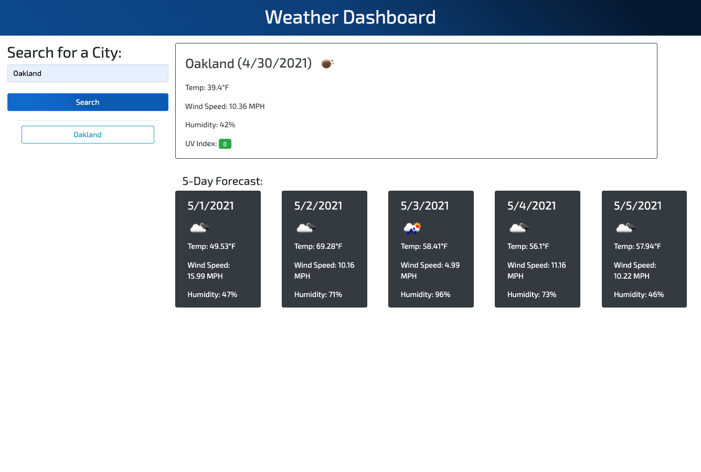

# Weather Dashboard

An application that will allow users to search for city names and get their current weather conditions as well as a five day forecast. 

## Usage
* When the application loads it will display a search bar for users to input a city name.
* When the user clicks the button to search for that name the application will then display that city's current weather indformation as well as a five day forecast, inlcuding temperature, wind speeds, humidity and UV index.
* When a user searches for a city the name is stored and displayed as a button on the page, when the button is click the information for that city is again retrieved and displayed on the page.
* Application will have responsive styling to be usable on a variety of screen sizes. 

## Link to Deployed Application:
https://crossigarcia.github.io/weather-dashboard

## Screenshot of Application

